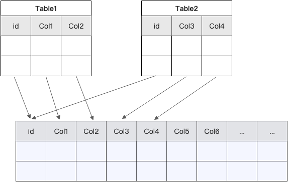

# Partial-Update 目录开发规范

## 一、目录结构规范

```
Partial-Update/
├── readme.md              # 功能说明文档
├── image.png             # 架构示意图或流程图
├── prepare_table.sql     # 创建表结构
├── insert.sql            # 插入测试数据
├── etl.sql               # ETL处理逻辑
├── create-tables.sh      # 执行建表脚本
├── insert-select.sh      # 执行插入数据脚本
└── etl.sh                # 执行ETL脚本
```

## 二、文件命名规范

### 1. 命名规则
- 使用小写字母和连字符 `-` 或下划线 `_`


### 2. 表命名规范
- 使用下划线分隔的小写单词


## 三、SQL 编写规范

### 1. 统一模板头
所有 SQL 文件必须以以下模板开头：

```sql
CREATE CATALOG ‘$catalog 名称’
WITH (
    'type' = 'fluss'
    ,'bootstrap.servers' = 'localhost:9123'
);

USE CATALOG '自定义 catalog 名称';

CREATE DATABASE IF NOT EXISTS `自定义 DATABASE 名称`;

USE `自定义 DATABASE 名称`;
```

### 2. 表结构定义规范
- 使用 `CREATE TABLE IF NOT EXISTS` 避免重复创建
- 表名使用完全限定名：`` `fluss_demo`.fluss.`表名` ``
- 字段说明使用行尾注释：`rec_score DOUBLE,   -- updated by recs stream`
- 主键定义：`PRIMARY KEY (user_id, item_id) NOT ENFORCED`


示例：
```sql
CREATE TABLE IF NOT EXISTS `fluss_demo`.fluss.recommendations (
    user_id  STRING,
    item_id  STRING,
    rec_score DOUBLE,
    rec_ts   TIMESTAMP(3),
    PRIMARY KEY (user_id, item_id) NOT ENFORCED
) WITH ('bucket.num' = '3');
```

### 3. 数据插入规范
- 使用多行 VALUES 格式，每条记录独立一行
- 时间戳使用 `TIMESTAMP 'YYYY-MM-DD HH:MM:SS'` 格式

示例：
```sql
INSERT INTO `fluss_demo`.fluss.recommendations VALUES
    ('user_101','prod_501',0.92 , TIMESTAMP '2025-05-16 09:15:02'),
    ('user_101','prod_502',0.78 , TIMESTAMP '2025-05-16 09:15:05'),
    ('user_102','prod_503',0.83 , TIMESTAMP '2025-05-16 09:16:00');
```

### 4. ETL 处理规范
- 使用 `BEGIN STATEMENT SET;` 包裹多个 INSERT 语句


### 5. SQL 格式化规范
- SQL 关键字大写：`CREATE`, `INSERT`, `SELECT`, `FROM`, `WHERE`, `WITH`
- SQL 语句以分号 `;` 结尾
- 适当使用空行分隔不同逻辑块

## 四、Shell 脚本规范

### 1. 脚本结构
- 第一行使用 `#` 注释说明脚本用途
- 统一使用 Flink SQL Client 执行 SQL 文件
- 使用绝对路径引用 SQL 文件

### 2. 调用方式
```bash
# 脚本功能说明
bash /opt/flink/bin/sql-client.sh -f /opt/data/xxx/xxx.sql
```

### 3. 脚本命名对应
- `create-tables.sh` → `prepare_table.sql`（建表）
- `insert-select.sh` → `insert.sql`（插入数据）
- `etl.sh` → `etl.sql`（ETL处理）

## 五、文档规范

### 1. readme.md 结构
```markdown
# Partial Update（宽表拼接）
更新时间：2025-08-05 09:47:23

## 业务场景
[描述使用场景]

## 问题分析
[传统方式的痛点]

## 解决方案
[Fluss Partial Update方案说明]

## 架构图


## 技术细节
[底层机制说明]

## 注意事项
[重要提示]
```

### 2. 文档内容要求
- **标题**：清晰描述功能主题
- **更新时间**：记录最后修改时间，格式：`更新时间：YYYY-MM-DD HH:MM:SS`
- **业务场景**：说明为什么需要这个功能
- **问题分析**：列出传统方式的痛点（状态规模、性能瓶颈、调试困难、数据一致性等）
- **解决方案**：详细说明 Partial Update 的实现方式
- **架构图**：嵌入 `image.png` 展示数据流
- **技术细节**：说明底层机制（增量更新、字段合并等）
- **注意事项**：重要提示（如 catalog 命名规则）

## 六、执行规范

### 1. 脚本执行顺序
```bash
# 1. 创建表
bash /opt/data/Partial-Update/create-tables.sh

# 2. 插入测试数据
bash /opt/data/Partial-Update/insert-select.sh

# 3. 执行 ETL
bash /opt/data/Partial-Update/etl.sh
```

### 2. 权限设置规范
**重要：每次创建了新的 `.sh` 文件，必须执行以下命令设置权限：**

```bash
chmod -R 777 /opt/data/
```

这确保所有脚本都具有可执行权限。

## 七、代码注释规范

### 1. SQL 注释
- 使用 `--` 进行单行注释
- 关键字段添加行尾注释说明来源
- 逻辑分段使用空行和注释分隔

### 2. Shell 注释
- 脚本第一行必须有功能说明
- 关键步骤添加注释说明

## 八、关键特性说明

Partial Update 模式的核心特点：

1. **多源独立更新**：多个源表独立更新同一张宽表的不同字段
2. **主键自动合并**：通过主键自动合并记录，无需复杂 Join
3. **降低状态压力**：避免多流 Join，显著降低 Flink 作业状态压力
4. **实时性保证**：增量更新机制，确保记录始终是最新的完整状态
5. **易维护性**：简化数据管道，降低维护复杂度

## 九、常见注意事项

1. **Catalog 命名**：创建 catalog 时不能使用 `-` 符号
2. **Catalog 创建**：每次使用都需要重新创建 catalog
3. **测试数据**：确保测试数据的主键覆盖所有需要验证的场景
